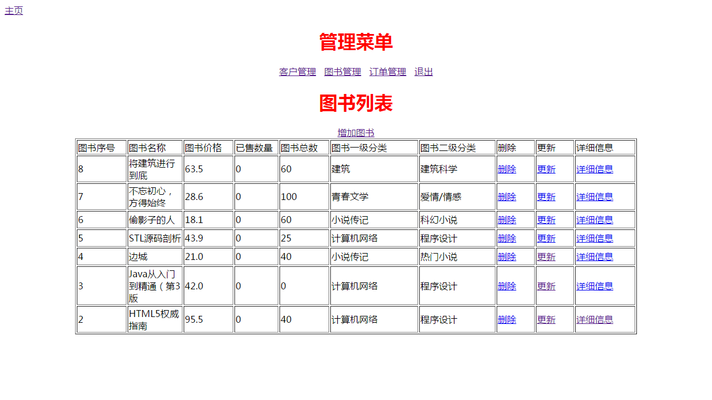
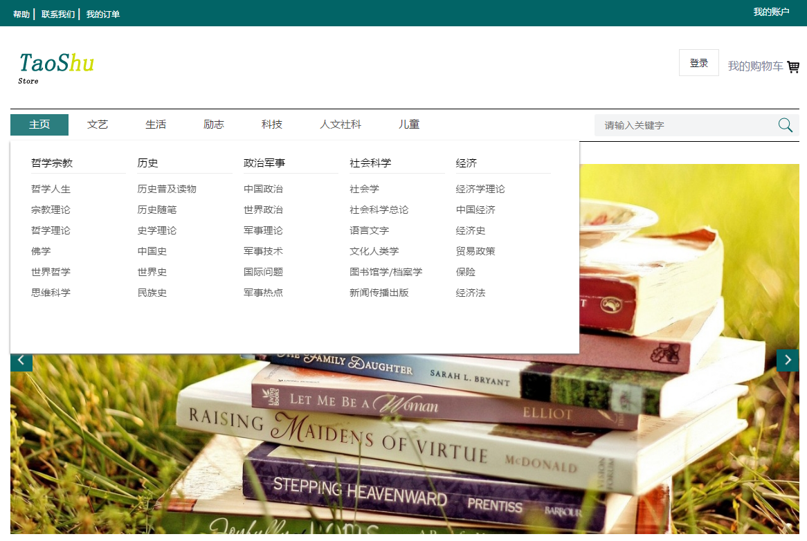
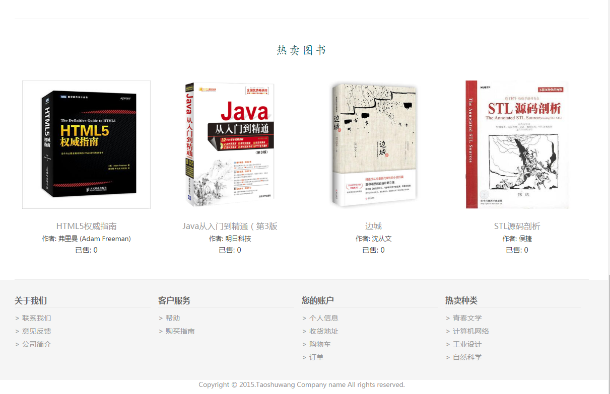
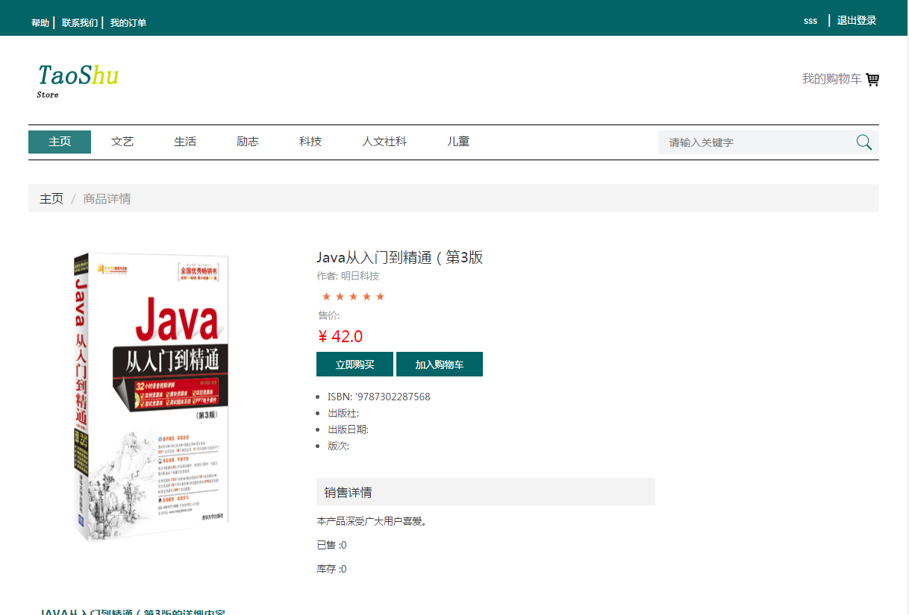
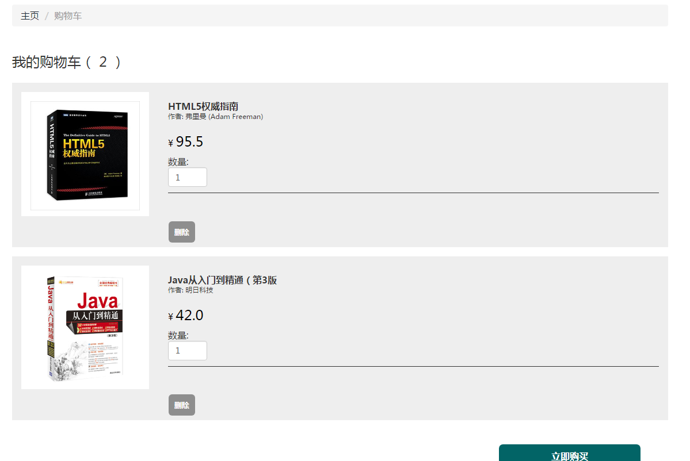
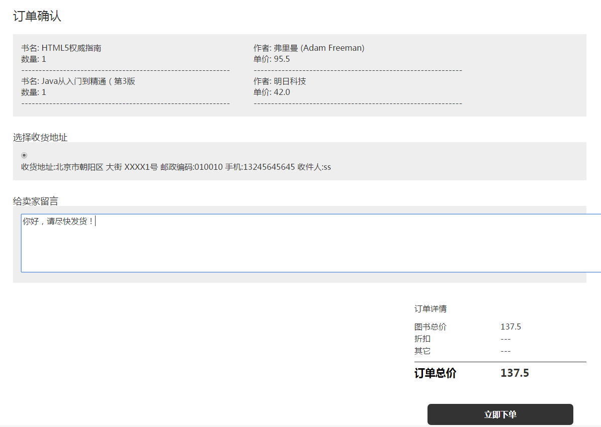
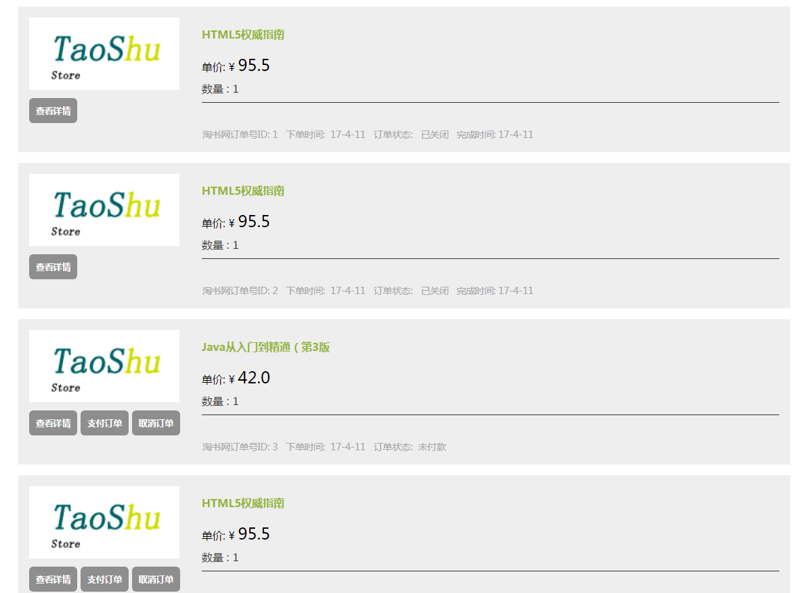

淘书网
----

我的博客：[并非菜鸟](https://songyaxu.github.io)
=====
##介绍
本网找包括2个部分，一个是管理员部分，一个是淘书网部分，管理员可以管理本店的图书、用户、和订单。
淘书网可以提供买家查看并购买图书。
因为初次使用框架，所以用起来比较生疏，可能会存在不足的地方。

+ 网站管理员登录入口:http://localhost:**PORT**/taoshuwang/adminLogin.jsp
+ 淘书网入口:http://localhost:**PORT**/taoshuwang/LoadProduct.action

管理员登录进入页面：

看上去很简陋，因为商家并不需要多好的界面（其实还是当时自己做的时候没时间了，所以做的比较简陋），所以并没有做什么界面。住要是完成了最基本的

1. 客户管理
2. 图书管理
3. 订单管理

淘书网入口：

我们看到入口链接是一个**action**(LoadProduct.action)是因为需要从数据库中加载一些数据到主页。因为自己当时还没用过ajax，所以就没有使用异步取数据的这种方法来加载数据。

商品详情界面：

购物车界面：

下订单界面：

订单详情界面：

